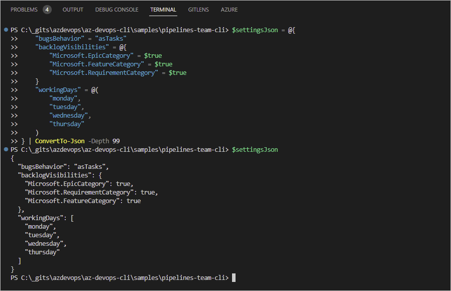

# Update-ADOTeam-Settings

You can execute this function to update Azure DevOps team settings.

> **Note**: Use it as part of a self-service solution to meet organizational governance requirements.

## Summary

- Script name : Update-ADOTeam-Settings.ps1
- Authors : Martin Swinkels, DevOps Engineer at MSc365.eu
- Version : 1.230118.0-beta
- Dependencies : [az cli](https://learn.microsoft.com/en-us/cli/azure/install-azure-cli), [az devops extension](https://learn.microsoft.com/en-us/cli/azure/devops?view=azure-cli-latest)

## Parameters

| Name | Description |
| --- | --- |
| Organization | Name of the organization. |
| ProjectName | Name of the project where to create a team. |
| TeamName | Name of the team to create. |
| TeamSettings | Settings of the team to update in JSON format. |
| Version | The API version to use with the Invoke end point; default 7.1-preview. |

## Example

The first thing to do is to create a Json formatted string for the settings you want to be updated.



```powershell
    $settingsJson = @{
        "bugsBehavior" = "asRequirements"
        "backlogVisibilities" = @{
            "Microsoft.EpicCategory" = $true
            "Microsoft.FeatureCategory" = $true
            "Microsoft.RequirementCategory" = $true
        }
        "workingDays" = @(
            "monday", 
            "tuesday", 
            "wednesday", 
            "thursday"
        )
    } | ConvertTo-Json -Depth 99
```

### bugsBehavior options

- asRequirements  
  Bugs are managed with requirements.
- asTask  
  Bugs are managed with tasks.
- off  
  Bugs are not managed on backlogs and boards.

Then run the following command and set `$settingsJson` as argument for the `-TeamSettings` parameter.

```powershell
    .\Update-ADOTeam-Settings.ps1 `
        -Organization $env:MSC365_ORGANIZATION -ProjectName $env:MSC365_PROJECT_NAME `
        -TeamName $env:MSC365_TEAM_NAME -TeamSettings $settingsJson -Verbose
```

> The following local/pipeline variables must be set as part of the solution:

```powershell
    $env:MSC365_ORGANIZATION = "msc365"
    $env:MSC365_PROJECT_NAME = "az-devops"
    $env:MSC365_TEAM_NAME = "Demo Team A"
    $env:MSC365_API_VERSION = "7.1-preview"
    $env:MSC365_PAT = "{YOUR PAT GOES HERE}"
```

```powershell
    $env:AZURE_DEVOPS_EXT_PAT = $env:MSC365_PAT
    $env:AZURE_DEVOPS_EXT_GIT_SOURCE_PASSWORD_OR_PAT = $env:MSC365_PAT
```

## Disclaimer

THIS CODE IS SAMPLE CODE. THESE SAMPLES ARE PROVIDED "AS IS" WITHOUT WARRANTY OF ANY KIND.
MICROSOFT FURTHER DISCLAIMS ALL IMPLIED WARRANTIES INCLUDING WITHOUT LIMITATION ANY IMPLIED WARRANTIES
OF MERCHANTABILITY OR OF FITNESS FOR A PARTICULAR PURPOSE. THE ENTIRE RISK ARISING OUT OF THE USE OR
PERFORMANCE OF THE SAMPLES REMAINS WITH YOU. IN NO EVENT SHALL MICROSOFT OR ITS SUPPLIERS BE LIABLE FOR
ANY DAMAGES WHATSOEVER (INCLUDING, WITHOUT LIMITATION, DAMAGES FOR LOSS OF BUSINESS PROFITS, BUSINESS
INTERRUPTION, LOSS OF BUSINESS INFORMATION, OR OTHER PECUNIARY LOSS) ARISING OUT OF THE USE OF OR
INABILITY TO USE THE SAMPLES, EVEN IF MICROSOFT HAS BEEN ADVISED OF THE POSSIBILITY OF SUCH DAMAGES.
BECAUSE SOME STATES DO NOT ALLOW THE EXCLUSION OR LIMITATION OF LIABILITY FOR CONSEQUENTIAL OR
INCIDENTAL DAMAGES, THE ABOVE LIMITATION MAY NOT APPLY TO YOU.
