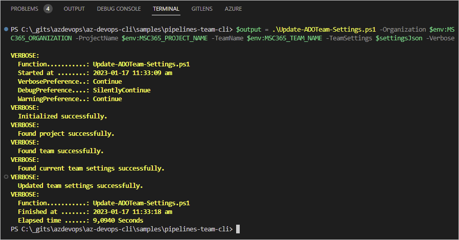

# Update-ADOTeam-Settings

This function can be used to update team settings in Azure DevOps. I created this function as part of a self-service solution on Azure DevOps, to meet organizational governance requirements, while users are creating new DevOps projects and teams.

> **Note**: I assume a basic knowledge of working with Azure DevOps, [az cli](https://learn.microsoft.com/en-us/cli/azure/install-azure-cli), and [az devops extension](https://learn.microsoft.com/en-us/cli/azure/devops?view=azure-cli-latest). Therefore I will not go into details. I only provide this function and an explanation of how to use it.

## Summary

- Script name : Update-ADOTeam-Settings.ps1
- Authors : Martin Swinkels, DevOps Engineer at MSc365.eu
- Version : 1.230118.0-beta
- Dependencies : [az cli](https://learn.microsoft.com/en-us/cli/azure/install-azure-cli), [az devops extension](https://learn.microsoft.com/en-us/cli/azure/devops?view=azure-cli-latest)

## Parameters

| Name | Description |
| --- | --- |
| Organization | Name of the organization. |
| ProjectName | Name of the project where to create a team. |
| TeamName | Name of the team to create. |
| TeamSettings | Settings of the team to update in JSON format. |
| Version | The API version to use with the Invoke end point; default 7.1-preview. |

## How to use it?

1. Create a Json formatted string for the settings you want to update.

    ```powershell
    $settingsJson = @{
        "bugsBehavior" = "asRequirements"
        "backlogVisibilities" = @{
            "Microsoft.EpicCategory" = $true
            "Microsoft.FeatureCategory" = $true
            "Microsoft.RequirementCategory" = $true
        }
        "workingDays" = @(
            "monday", 
            "tuesday", 
            "wednesday", 
            "thursday"
        )
    } | ConvertTo-Json -Depth 99
    ```

    **bugsBehavior options**

    - asRequirements  
    Bugs are managed with requirements.
    - asTask  
    Bugs are managed with tasks.
    - off  
    Bugs are not managed on backlogs and boards.

    <br>

    <a href="../assets/img/posts-az-devops-settings-json.png" target="_blank"></a>  

    <small>Run command sample</small>

2. Set the following local variables as part of this solution, or provide parameters directly.

    ```powershell
    $env:MSC365_ORGANIZATION = "msc365"
    $env:MSC365_PROJECT_NAME = "az-devops"
    $env:MSC365_TEAM_NAME = "Demo Team A"
    $env:MSC365_API_VERSION = "7.1-preview"

    # Make sure you have set a PAT in Azure DevOps with sufficient permissions.
    $env:MSC365_PAT = "{YOUR PAT GOES HERE}"
    $env:AZURE_DEVOPS_EXT_PAT = $env:MSC365_PAT
    $env:AZURE_DEVOPS_EXT_GIT_SOURCE_PASSWORD_OR_PAT = $env:MSC365_PAT
    ```

3. Run the following command and set `$settingsJson` as argument for the `-TeamSettings` parameter.

    ```powershell
    .\Update-ADOTeam-Settings.ps1 `
        -Organization $env:MSC365_ORGANIZATION -ProjectName $env:MSC365_PROJECT_NAME `
        -TeamName $env:MSC365_TEAM_NAME -TeamSettings $settingsJson -Verbose
    ```

    <a href="../assets/img/posts-az-devops-update-adoteam-settings-ps1.png" target="_blank"></a>  

    <small>Run function sample</small>

4. That's it, check your updates on Azure DevOps.

## Azure Pipelines

This sample script is executed on a local device, but you could also use this script in an Azure Pipeline as I did for a self-service DevOps organization.

## Disclaimer

THIS CODE IS SAMPLE CODE. THESE SAMPLES ARE PROVIDED "AS IS" WITHOUT WARRANTY OF ANY KIND.
MICROSOFT FURTHER DISCLAIMS ALL IMPLIED WARRANTIES INCLUDING WITHOUT LIMITATION ANY IMPLIED WARRANTIES
OF MERCHANTABILITY OR OF FITNESS FOR A PARTICULAR PURPOSE. THE ENTIRE RISK ARISING OUT OF THE USE OR
PERFORMANCE OF THE SAMPLES REMAINS WITH YOU. IN NO EVENT SHALL MICROSOFT OR ITS SUPPLIERS BE LIABLE FOR
ANY DAMAGES WHATSOEVER (INCLUDING, WITHOUT LIMITATION, DAMAGES FOR LOSS OF BUSINESS PROFITS, BUSINESS
INTERRUPTION, LOSS OF BUSINESS INFORMATION, OR OTHER PECUNIARY LOSS) ARISING OUT OF THE USE OF OR
INABILITY TO USE THE SAMPLES, EVEN IF MICROSOFT HAS BEEN ADVISED OF THE POSSIBILITY OF SUCH DAMAGES.
BECAUSE SOME STATES DO NOT ALLOW THE EXCLUSION OR LIMITATION OF LIABILITY FOR CONSEQUENTIAL OR
INCIDENTAL DAMAGES, THE ABOVE LIMITATION MAY NOT APPLY TO YOU.
